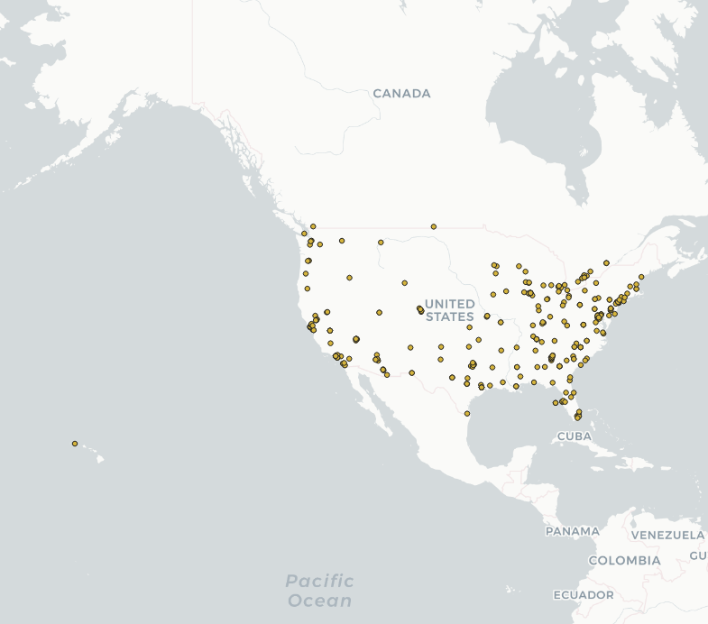
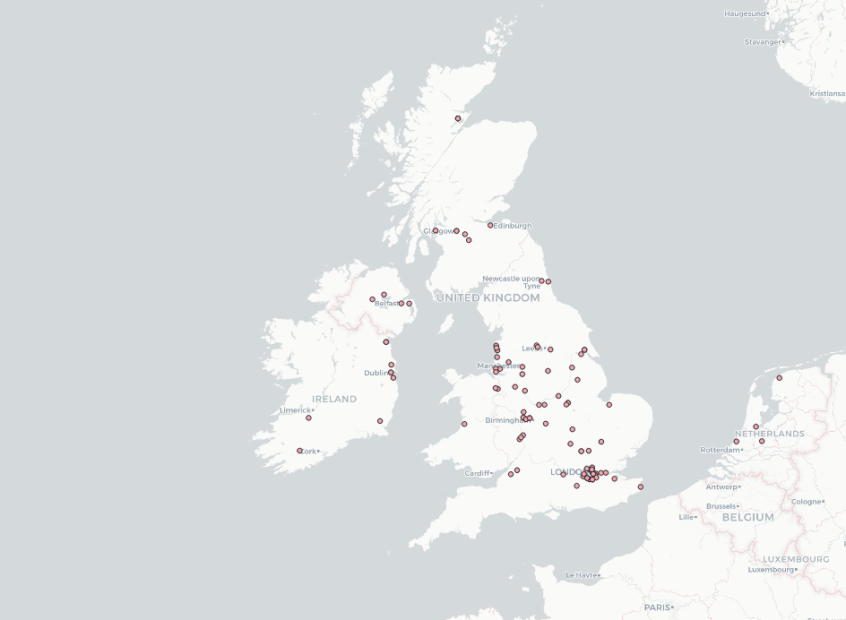
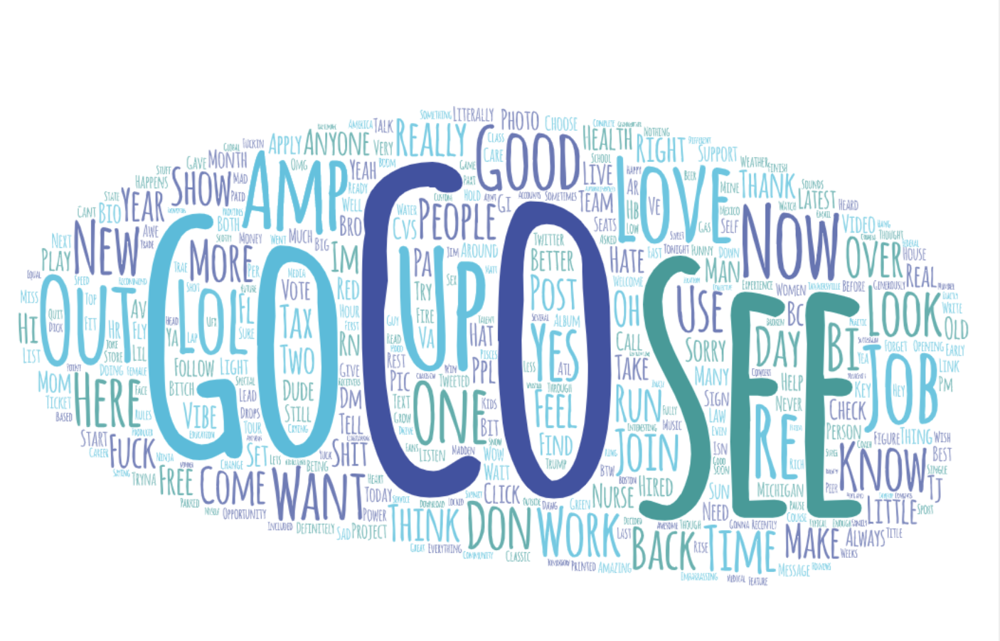
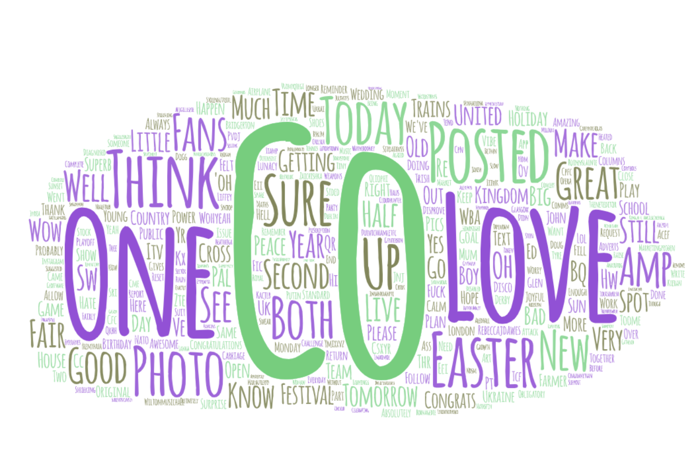

### Introduction
For Lab 2, I choose to make my twitter analysis on two different countries at the same period of time. The reason I chose to make a comparison between the two counties was because in my opinion, USA and UK shared alot of similarities. Although United States or America and United Kingdom are on two differetn contients, they shared alot of commons. Aside from sharing English as a predominent language, they also have the same form of government as well. Therefore, I think it would be interesting to see what people are saying or mentioning in twitter at the same time.

### Map Comparison

These two maps represent the location from where the twitter users are located at. The first image is an image of the location of the twitter user who were posting during the time I downloaded the data. The same goes for the UK map. From the USA map, we see that alot of the tweets are more concentrated on the east and west. For the U.K. map, it is more concentrated around London.

### Wordcloud Comparison

The word cloud are a visualization of the most repeated words in the twitter data that we got from two countries on Monday April,18th 2022. One of the most used word from both countries is the word 'CO'. For the USA wordcloud, we also see words such as "Go", "See" and "Job". For U.K., we see words such as "Love", "Easter" and "One". I think it is interesting to see what people are thinking or what might be trending at those countries during that specific time. Some words are harder to guess without the whole context.
